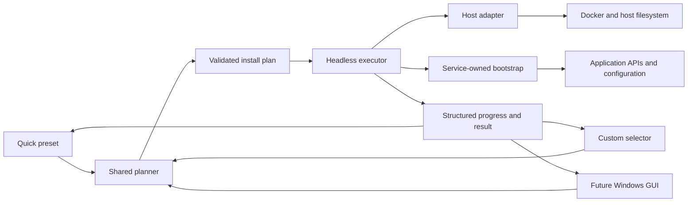

# Cross-platform installer architecture roadmap

## Purpose

This document lists the work needed to turn MasterBuilder's current Linux Quick
installer into one shared installer that can support:

- the existing preconfigured Quick installation;
- a selective Custom installation;
- the current Linux command-line workflow;
- a future Windows .NET application with a guided GUI;
- additional containers, plugins, hooks, and service integrations without
  creating a second installer or duplicating business rules.

The work is being developed on `architecture/shared-installer-engine`.


## Decisions already made

| Question | Decision | Reason |
|---|---|---|
| Should Linux and Windows each get a complete `bootstrap` tree? | No. Keep `bootstrap/<owner>/` service-first. | Two operating-system trees would duplicate application rules and drift. |
| Where does OS-specific behavior belong? | In platform adapters or platform applications, not in duplicated service definitions. | Docker installation, paths, permissions, elevation, and packaging truly differ by host. |
| What is shared by Quick and Custom? | Component definitions, dependency rules, planning, lifecycle ordering, execution, and verification. | Quick and Custom differ only in how the selection is produced. |
| What is the future GUI responsible for? | Gathering choices, showing the plan, requesting confirmation, and displaying progress. | Business rules must remain in a headless core so the GUI stays simple. |
| What owns cross-service configuration? | The component that is being configured. | Ownership remains clear; there is no global integration junk drawer. |
| How is the migration performed? | Add the new path beside the working path, compare them, test them, then request approval before cleanup. | The current working setup remains recoverable throughout the migration. |
| When can runtime work continue? | Only after the user runs each new or changed executable slice and reports the result. | The Linux VM and Windows machine are the authoritative environments. |


## How it should work



Quick, Custom, and the GUI must never contain separate copies of installation
rules. Each one makes the same kind of install plan. The same code then runs
that plan and reports what happened.


## Quick and Custom only choose what to install

| Concern | Quick | Custom | Shared after selection |
|---|---|---|---|
| Component choice | A repository-owned preset selects the supported full stack. | The user chooses from registered components and capabilities. | Planner validates the resulting selection. |
| Plugin choice | The Quick profile explicitly lists its managed plugins. | Each plugin can be selected independently when dependencies allow it. | The same plugin definitions and installer run. |
| Dependency handling | The preset is invalid if a required dependency is absent. | Required dependencies are explained and added only with user confirmation. | The same `requires`, `after`, `conflicts`, and capability rules apply. |
| Values | Defaults are preconfigured; only machine paths, credentials, and secrets require input. | The user is guided only through values needed by the selected components. | The same validation and environment contract apply. |
| Execution | No Quick-specific executor. | No Custom-specific executor. | One ordered plan, executor, verification model, and result. |
| Rerun | Reconcile the complete Quick-managed state. | Reconcile only the selected managed state. | Idempotent ensure-and-verify behavior. |

The installation mode is plan provenance, not an execution branch. Once a plan
exists, the executor should not need to know whether it came from Quick, Custom,
the command line, or the GUI.


## What Linux and Windows share

| Responsibility | Shared | Linux implementation | Windows implementation |
|---|---:|---|---|
| Component IDs and metadata | Yes | Reads the shared files. | .NET reads the same shared files. |
| Quick preset and Custom selections | Yes | CLI produces a plan. | GUI or CLI produces the same plan. |
| Dependency and lifecycle rules | Yes | Shared schema and planner contract. | Shared schema and .NET Core models. |
| Compose service definitions | Yes | Docker Compose consumes the YAML. | Docker Desktop Compose consumes the same YAML. |
| Plugin, profile, and custom-format definitions | Yes | Existing bootstraps consume JSON. | Future engine consumes the same definitions. |
| Application configuration intent | Yes | Current service-owned Bash implementation. | Port owner-by-owner only when needed; do not fork definition data. |
| Docker availability | Contract only | Engine/package-manager/service checks. | Docker Desktop/engine checks and guided remediation. |
| Dependency installation | No | Distribution/package-manager logic in `lib/linux/`. | Windows package/install guidance and elevation adapter. |
| Paths and persistent directories | Names are shared; resolution differs. | POSIX paths, UID/GID, ownership, permissions. | Windows paths, Compose path conversion, ACLs, Docker Desktop sharing. |
| Secrets | Required keys are shared; storage differs. | Private `.env` initially, with values never logged. | Protected UI input and an appropriate Windows secret store or private file. |
| Process elevation | No | `sudo`/root boundary. | UAC/administrator boundary. |
| User interaction | Contract only | Small CLI prompts around a headless engine. | Guided .NET GUI. |
| Packaging and updates | Release contract only | Shell/repository or future packaged CLI. | Signed .NET application/installer in a later phase. |
| Progress and errors | Yes | Executor emits structured events plus readable output. | GUI renders the same event and result model. |


## Folder rule

Do not create `bootstrap/linux/` and `bootstrap/windows/` as parallel complete
implementations. Keep application ownership first:

```text
bootstrap/
|-- jellyfin/
|   |-- setup.sh
|   |-- plugins.sh
|   `-- plugins/
|-- seerr/
`-- ...
```

Only a proven platform difference may introduce a narrowly named adapter under
the owning component. Host-wide differences belong outside `bootstrap`.

Start with this small layout. Add more folders only when real code needs them:

```text
installer/
|-- services/                # one small file for each available service
`-- profiles/                # Quick and later saved choices

bootstrap/
|-- jellyfin/                # Jellyfin and Jellyfin-plugin ownership
|-- seerr/                   # Seerr ownership
`-- ...

lib/
`-- linux/                   # Linux host and Bash execution libraries

src/                         # future; do not create until the contract is stable
|-- MasterBuilder.Core/      # plan models, rules, validation; no GUI
|-- MasterBuilder.Engine/    # headless plan execution and progress
|-- MasterBuilder.Platform.Windows/ # Docker Desktop, paths, elevation
`-- MasterBuilder.Windows/   # thin guided GUI

linux-setup.sh               # compatibility entry point during migration
windows-setup.ps1            # compatibility/prototype entry point during migration
quick-stack.txt              # compatibility manifest until plan parity is proven
```

The future .NET code must depend inward: the Windows GUI depends on Core and the
Engine; Core never depends on the GUI or on Windows-only APIs. A Linux .NET
adapter is optional later, not a requirement for starting the shared contract.


## What current code can be reused

| Current artifact | Reuse classification | Intended boundary |
|---|---|---|
| `compose/**/*.yml` | Directly shared across Quick, Custom, Linux, and Windows. | Referenced by component definitions and plans; not copied. |
| `quick-stack.txt` | Useful compatibility input, but describes only Compose selection. | Keep until a Quick profile produces an equivalent full plan. |
| `bootstrap/*/custom-formats/*.json` | Directly reusable definition data. | Remain owner-scoped; selected capabilities reference them. |
| `bootstrap/*/profiles/*.json` | Directly reusable definition data. | Remain owner-scoped; dependency validation happens in the planner. |
| `bootstrap/jellyfin/plugins/plugins.json` | Contains reusable data but has the wrong all-plugins-in-one shape. | Migrate additively to one file per plugin, then allow profile selection. |
| `bootstrap/<service>/*.sh` | Reusable Linux behavior, not cross-platform executable code. | Keep service-owned; expose clear inputs, exit status, and verification. |
| Repeated logging and HTTP/status helpers | Candidate library code only after exact duplication is confirmed. | Extract small Linux/Bash helpers; do not create a vague global utility dump. |
| Sonarr and Radarr format/profile code | Strong DRY candidate, but endpoints and policies must be compared first. | Share definitions first; extract an Arr library only for genuinely identical behavior. |
| `linux-setup.sh` environment initialization | Mixed responsibility. | Split shared key/default metadata from Linux path, UID/GID, and file-writing behavior. |
| `linux-setup.sh` directory initialization | Mixed responsibility. | Directory names come from definitions; creation/permissions remain Linux adapter behavior. |
| `load_quick_files` / `compose_quick` | Good first extraction seam. | Manifest/plan loading separated from a Linux Compose command adapter. |
| Stack health and mount checks | Reusable verification intent with host-specific mechanics. | Plan declares required checks; Linux and Windows adapters perform them. |
| `run_quick_configuration` | Current hard-coded lifecycle. | Replace additively with ordered plan steps after parity tests. |
| `lib/linux/dependencies.sh` | Linux-only and already correctly scoped. | Keep Linux-only; split further only when a focused reason appears. |
| `windows-setup.ps1` | Useful prototype and compatibility path, but behind Linux behavior. | Keep working; do not extend it by copying every Bash bootstrap. Future GUI consumes the shared plan. |

The current shell functions rely heavily on global state and process exits. They
can become Linux libraries after their inputs and results are explicit. They
should not be presented as a cross-platform library merely because PowerShell
or .NET could launch Bash.


## Only five parts

We only need these parts now:

| Part | Job | Example |
|---|---|---|
| Service file | Says what can be installed and which Compose and setup files belong to it. | Jellyfin points to its Compose file and `bootstrap/jellyfin/setup.sh`. |
| Choice file | Lists what should be installed. | Quick lists everything. Custom will contain the user's choices. |
| Runner | Reads the choices, checks what they need, and runs them in the right order. | Linux Quick and the future GUI call the same runner. |
| System helper | Handles work that differs between Linux and Windows. | Linux permissions or Windows path conversion. |
| Service setup | Configures and checks one app. | Bazarr owns its Sonarr and Radarr connection settings. |

Do not add a general conflict system, retry system, event system, or separate
saved-plan format now. Add one only when a real feature needs it.

Secrets stay in `.env` or the future Windows secret storage. They do not belong
in service or choice files.


## Plugin and integration placement

One plugin per definition file is the intended shape. Selection belongs in the
Quick profile or Custom plan, not in an all-or-nothing installer manifest.

```text
bootstrap/jellyfin/plugins/
|-- enhanced/
|   |-- plugin.json
|   `-- configure-seerr.sh       # future, owned by Enhanced/Jellyfin
|-- intro-skipper/
|   `-- plugin.json
`-- shokofin/
    |-- plugin.json              # future
    `-- configure-shoko.sh       # future
```

The final names will be chosen when the plugin schema is implemented. The rule
is more important than the exact directory spelling:

- Enhanced can be installed without Intro Skipper.
- Enhanced's Seerr option declares an ordering dependency on completed Seerr
  setup; it is not a global integration script.
- Shokofin declares a hard requirement on Shoko and waits for Shoko readiness
  before configuration.
- The plugin runner installs selected definitions, batches required Jellyfin
  restarts, then runs post-restart configuration in dependency order.


## Task table

The status tells us whether a task is done, next, planned, waiting for your
test, or waiting for your approval. Every task that changes a running installer
must stop for your test before work that depends on it begins.

| ID | Status | What we will do | Part of the project | Check before moving on | Commit |
|---|---|---|---|---|---|
| MB-000 | complete | Create `architecture/shared-installer-engine`. | Git isolation | Confirm clean branch based on current `main`. | No code commit. |
| MB-001 | complete | Put the safe-change and user-test rules in `AGENTS.md`. | Project rules | Review the change; no setup test is needed. | `modified AGENTS.md with additive migration and validation gates` |
| MB-002 | complete | Add this task list and link it from `AGENTS.md`. | Project documents | Check the document and link; no setup test is needed. | `added cross-platform installer architecture roadmap` |
| MB-010 | complete | Write down exactly what the installer starts, configures, and checks today in `docs/current-installer.md`. | Current installer | Compare the document with `quick-stack.txt`, the Compose files, and every setup script. | `added map of what the current installer does` |
| MB-011 | complete | Write down the current order in `docs/current-run-order.md`: what runs first, what waits, and which parts need other parts. | Run order | Review it with the user before adding more containers, plugins, hooks, or setup scripts. | `added current installer run order` |
| MB-012 | complete | Keep only five parts: service file, choice file, runner, system helper, and service setup. | Code responsibilities | Check that every part has one clear job and remove ideas we do not need yet. | `modified installer plan to keep the design small` |
| MB-020 | complete | Add the first small service file for Jellyfin. It contains only its ID, name, Compose file, Docker service, Linux setup script, and needs. | Shared data files | Parse the JSON and check every path and service name against the current files. | `added first shared Jellyfin service file` |
| MB-021 | complete | Add a small file for every current Quick service and the shared Docker network. | Service list | Parse every JSON file and compare all Compose files, Docker names, setup scripts, and needs with the current code. | Three focused `added ... service files` commits. |
| MB-022 | complete | Add a Quick file that selects everything the current Quick install uses. | Quick choices | Compare it with `quick-stack.txt` and `QUICK_CONFIG_*`; no setup behavior changes. | `added preconfigured Quick installation profile` |
| MB-023 | complete | Add a command that only shows and checks an install plan. The current installer stays unchanged. | Plan checker | Test good and bad plans and make sure secrets are hidden. Then STOP: the user runs it on the Linux VM. | `added shared installation plan checker` |
| MB-024 | complete | Make sure the new Quick plan matches everything the current Quick installer does. | Same-results check | STOP until the user accepts the Linux VM result and every difference is fixed. | `fixed ...` as needed, then `finished Quick plan matching` |
| MB-030 | complete | Move the reusable Compose file loading and command building out of `linux-setup.sh`. | Linux helper code | Check the helper without Docker. Then STOP so the user can run the existing Verify command. | `added reusable Linux Compose helper` and `modified Linux installer to use Compose helper` |
| MB-031 | complete | Add an optional Linux command that runs a plan using the existing service setup scripts. Keep `quick` unchanged. | Linux plan runner | Show the plan first. Then STOP: the user runs it against the existing Linux stack and confirms every setup completes. | `added optional Linux plan runner` plus `fixed ...` as needed. |
| MB-032 | waiting for approval | Make Linux Quick use the shared plan runner while keeping the old path available. | Quick changeover | STOP: test a new install and a rerun on Linux; the user must approve the switch. | `modified Linux Quick Setup to use the shared engine` |
| MB-040 | planned | Add a Custom command that lets the user choose parts and makes the same kind of plan as Quick. | Custom choices | Check empty, small, and full choices. Explain missing required parts. STOP: the user reviews it before Custom can install anything. | `added Custom installation choices` |
| MB-041 | waiting for user test | Let Custom plans use the same tested runner as Quick. | Shared runner | STOP: the user tests several choices and reruns them on the Linux VM. | `added Custom installation execution` then `finished shared Quick and Custom engine` |
| MB-050 | waiting for user test | Keep one file for each Jellyfin plugin. First add support for the new files while the old file still works. | Jellyfin plugins | Check every plugin file and the Quick plugin list. STOP: the user installs the plugins and runs the setup again. | Use separate `added` and `modified` commits; use `finished` only after the test. |
| MB-051 | waiting for user test | Install chosen plugins, restart Jellyfin once, wait for it, and check the result. Never remove an unchosen plugin. | Plugin runner | STOP: the user checks a safe rerun and confirms the chosen plugins are active. | `modified Jellyfin plugin setup order` |
| MB-052 | planned | Put Enhanced's Seerr settings with Enhanced and run them only after Seerr is ready. | Enhanced plugin | STOP: test Quick with both, Custom without Enhanced, and a rerun. | `added Enhanced Seerr configuration`, then `finished ...` after the test. |
| MB-053 | planned | Make sure the same rules can say that Shokofin needs both Jellyfin and Shoko. Do not install them yet. | Required-parts rules | Check only example plan files now. A future Shokofin task will need a real test. | Commit only if a separate file changes. |
| MB-060 | planned | Keep normal terminal messages and also report each step in a form a GUI can read. | Progress reports | Check that secrets stay hidden. STOP: the user reviews real Quick output. | `added installer progress reports for the GUI` |
| MB-061 | planned | Let safe steps stop and retry. Add this only where it cannot damage user data. | Stop and retry | Test planned failures. STOP: test on the Linux VM before the GUI uses it. | Small `added` or `fixed` commits. |
| MB-070 | planned | Create the .NET code that reads and checks the same plans. It must not contain Windows screen code. | Shared .NET code | Run the same good and bad plan examples used by Linux. | `added shared .NET plan code` |
| MB-071 | planned | Add Windows code for Docker Desktop, paths, folders, administrator access, and private inputs. | Windows-only code | STOP: the user runs safe checks and shows a plan on Windows. | One commit for each small Windows part. |
| MB-072 | planned | Add a Windows command that can run the shared plan before building the GUI. Keep `windows-setup.ps1`. | Windows plan runner | STOP: test checking, starting, verifying, rerunning, and one safe failure on Windows. | `added Windows shared-plan runner` plus fixes. |
| MB-073 | planned | Build a simple .NET wizard for Quick or Custom, needed values, plan review, progress, and help after errors. | Windows GUI | STOP after each screen or small flow for the user's approval, then test the complete Windows install. | Use many small commits; use `finished Windows guided installer` after the final test. |
| MB-080 | planned | Keep a checklist showing what works on Linux and Windows in Quick and Custom. | Final checks | The user confirms every supported item by running it. | `added Linux and Windows installer checklist` plus focused fixes. |
| MB-090 | waiting for approval | Remove old files only after the new path does the same job and the user clearly approves removal. | Later cleanup | Check the replacement, move instructions, recovery path, and release point. | Use a separate `modified` or `finished` commit. |


## Before adding more features

Do not add another container, plugin, hook, or bootstrap capability until
MB-010 through MB-024 are accepted. Fixes to existing behavior remain allowed.
This gives every later feature a component definition, dependency vocabulary,
plan position, verification contract, and future GUI representation before its
runtime code is written.

Enhanced/Seerr and plugin-per-file work remain queued at MB-050 through MB-052,
after Quick and Custom share a proven plan. Shokofin/Shoko remains a future
feature, but its dependency shape is used to validate that the architecture is
capable of representing hard prerequisites.


## What I will ask you to test

At every STOP gate, the agent must provide all of the following and wait for the
user's result:

| Field | Required content |
|---|---|
| Environment | Linux VM or Windows machine, plus relevant prerequisites. |
| Command | Exact copyable command from the repository root. |
| Expected result | Visible messages and the intended application/container state. |
| Evidence | The small output section, status, screenshot, or application state the user should return. |
| Rerun | The command and expected unchanged/idempotent behavior when relevant. |
| Recovery | Safe instructions if the test fails; no destructive cleanup by default. |

No later dependent runtime task begins until the result is accepted. A failed
gate produces a focused `fixed` commit and repeats the same gate.


## How we know the design works

This roadmap succeeds when:

- Quick is still fully preconfigured;
- Custom selects the same registered bricks and uses the same executor;
- Linux remains supported throughout the migration;
- the Windows GUI contains presentation logic, not duplicated orchestration;
- new components and plugins are represented by definitions and owner-scoped
  behavior instead of edits scattered across multiple installers;
- dependency order is explicit and validated before execution;
- every executable slice has been confirmed by the user in its real environment;
- old compatibility paths are removed only through a later approved task.
