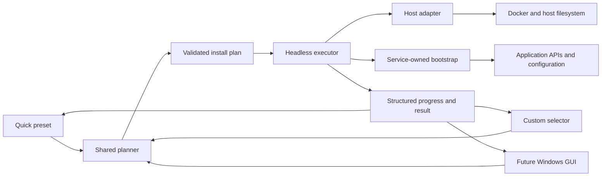

# Cross-platform installer architecture roadmap

## Purpose

This document is the durable task map for turning MasterBuilder's current
Linux Quick installer into one modular orchestration system that can support:

- the existing preconfigured Quick installation;
- a selective Custom installation;
- the current Linux command-line workflow;
- a future Windows .NET application with a guided GUI;
- additional containers, plugins, hooks, and service integrations without
  creating a second installer or duplicating business rules.

The work is being developed on `architecture/shared-installer-engine`.


## Decisions already made

| Question | Decision | Reason |
|---|---|---|
| Should Linux and Windows each get a complete `bootstrap` tree? | No. Keep `bootstrap/<owner>/` service-first. | Two operating-system trees would duplicate application rules and drift. |
| Where does OS-specific behavior belong? | In platform adapters or platform applications, not in duplicated service definitions. | Docker installation, paths, permissions, elevation, and packaging truly differ by host. |
| What is shared by Quick and Custom? | Component definitions, dependency rules, planning, lifecycle ordering, execution, and verification. | Quick and Custom differ only in how the selection is produced. |
| What is the future GUI responsible for? | Gathering choices, showing the plan, requesting confirmation, and displaying progress. | Business rules must remain in a headless core so the GUI stays simple. |
| What owns cross-service configuration? | The component that is being configured. | Ownership remains clear; there is no global integration junk drawer. |
| How is the migration performed? | Add the new path beside the working path, compare them, test them, then request approval before cleanup. | The current working setup remains recoverable throughout the migration. |
| When can runtime work continue? | Only after the user runs each new or changed executable slice and reports the result. | The Linux VM and Windows machine are the authoritative environments. |


## Target flow



Quick, Custom, and the GUI must never contain separate copies of installation
rules. They produce the same versioned installation plan and consume the same
result contract.


## Quick and Custom are selection strategies

| Concern | Quick | Custom | Shared after selection |
|---|---|---|---|
| Component choice | A repository-owned preset selects the supported full stack. | The user chooses from registered components and capabilities. | Planner validates the resulting selection. |
| Plugin choice | The Quick profile explicitly lists its managed plugins. | Each plugin can be selected independently when dependencies allow it. | The same plugin definitions and installer run. |
| Dependency handling | The preset is invalid if a required dependency is absent. | Required dependencies are explained and added only with user confirmation. | The same `requires`, `after`, `conflicts`, and capability rules apply. |
| Values | Defaults are preconfigured; only machine paths, credentials, and secrets require input. | The user is guided only through values needed by the selected components. | The same validation and environment contract apply. |
| Execution | No Quick-specific executor. | No Custom-specific executor. | One ordered plan, executor, verification model, and result. |
| Rerun | Reconcile the complete Quick-managed state. | Reconcile only the selected managed state. | Idempotent ensure-and-verify behavior. |

The installation mode is plan provenance, not an execution branch. Once a plan
exists, the executor should not need to know whether it came from Quick, Custom,
the command line, or the GUI.


## Shared versus platform-specific responsibilities

| Responsibility | Shared | Linux implementation | Windows implementation |
|---|---:|---|---|
| Component IDs and metadata | Yes | Reads the shared files. | .NET reads the same shared files. |
| Quick preset and Custom selections | Yes | CLI produces a plan. | GUI or CLI produces the same plan. |
| Dependency and lifecycle rules | Yes | Shared schema and planner contract. | Shared schema and .NET Core models. |
| Compose service definitions | Yes | Docker Compose consumes the YAML. | Docker Desktop Compose consumes the same YAML. |
| Plugin, profile, and custom-format definitions | Yes | Existing bootstraps consume JSON. | Future engine consumes the same definitions. |
| Application configuration intent | Yes | Current service-owned Bash implementation. | Port owner-by-owner only when needed; do not fork definition data. |
| Docker availability | Contract only | Engine/package-manager/service checks. | Docker Desktop/engine checks and guided remediation. |
| Dependency installation | No | Distribution/package-manager logic in `lib/linux/`. | Windows package/install guidance and elevation adapter. |
| Paths and persistent directories | Names are shared; resolution differs. | POSIX paths, UID/GID, ownership, permissions. | Windows paths, Compose path conversion, ACLs, Docker Desktop sharing. |
| Secrets | Required keys are shared; storage differs. | Private `.env` initially, with values never logged. | Protected UI input and an appropriate Windows secret store or private file. |
| Process elevation | No | `sudo`/root boundary. | UAC/administrator boundary. |
| User interaction | Contract only | Small CLI prompts around a headless engine. | Guided .NET GUI. |
| Packaging and updates | Release contract only | Shell/repository or future packaged CLI. | Signed .NET application/installer in a later phase. |
| Progress and errors | Yes | Executor emits structured events plus readable output. | GUI renders the same event and result model. |


## Folder rule

Do not create `bootstrap/linux/` and `bootstrap/windows/` as parallel complete
implementations. Keep application ownership first:

```text
bootstrap/
|-- jellyfin/
|   |-- setup.sh
|   |-- plugins.sh
|   `-- plugins/
|-- seerr/
`-- ...
```

Only a proven platform difference may introduce a narrowly named adapter under
the owning component. Host-wide differences belong outside `bootstrap`.

The following is a target layout, introduced gradually rather than in one large
move:

```text
orchestration/
|-- schemas/                 # versioned component and plan contracts
|-- components/              # one declarative component definition per file
`-- profiles/                # Quick and future named presets

bootstrap/
|-- jellyfin/                # Jellyfin and Jellyfin-plugin ownership
|-- seerr/                   # Seerr ownership
`-- ...

lib/
`-- linux/                   # Linux host and Bash execution libraries

src/                         # future; do not create until the contract is stable
|-- MasterBuilder.Core/      # plan models, rules, validation; no GUI
|-- MasterBuilder.Engine/    # headless plan execution and progress
|-- MasterBuilder.Platform.Windows/ # Docker Desktop, paths, elevation
`-- MasterBuilder.Windows/   # thin guided GUI

linux-setup.sh               # compatibility entry point during migration
windows-setup.ps1            # compatibility/prototype entry point during migration
quick-stack.txt              # compatibility manifest until plan parity is proven
```

The future .NET code must depend inward: the Windows GUI depends on Core and the
Engine; Core never depends on the GUI or on Windows-only APIs. A Linux .NET
adapter is optional later, not a requirement for starting the shared contract.


## Current code reuse inventory

| Current artifact | Reuse classification | Intended boundary |
|---|---|---|
| `compose/**/*.yml` | Directly shared across Quick, Custom, Linux, and Windows. | Referenced by component definitions and plans; not copied. |
| `quick-stack.txt` | Useful compatibility input, but describes only Compose selection. | Keep until a Quick profile produces an equivalent full plan. |
| `bootstrap/*/custom-formats/*.json` | Directly reusable definition data. | Remain owner-scoped; selected capabilities reference them. |
| `bootstrap/*/profiles/*.json` | Directly reusable definition data. | Remain owner-scoped; dependency validation happens in the planner. |
| `bootstrap/jellyfin/plugins/plugins.json` | Contains reusable data but has the wrong all-plugins-in-one shape. | Migrate additively to one file per plugin, then allow profile selection. |
| `bootstrap/<service>/*.sh` | Reusable Linux behavior, not cross-platform executable code. | Keep service-owned; expose clear inputs, exit status, and verification. |
| Repeated logging and HTTP/status helpers | Candidate library code only after exact duplication is confirmed. | Extract small Linux/Bash helpers; do not create a vague global utility dump. |
| Sonarr and Radarr format/profile code | Strong DRY candidate, but endpoints and policies must be compared first. | Share definitions first; extract an Arr library only for genuinely identical behavior. |
| `linux-setup.sh` environment initialization | Mixed responsibility. | Split shared key/default metadata from Linux path, UID/GID, and file-writing behavior. |
| `linux-setup.sh` directory initialization | Mixed responsibility. | Directory names come from definitions; creation/permissions remain Linux adapter behavior. |
| `load_quick_files` / `compose_quick` | Good first extraction seam. | Manifest/plan loading separated from a Linux Compose command adapter. |
| Stack health and mount checks | Reusable verification intent with host-specific mechanics. | Plan declares required checks; Linux and Windows adapters perform them. |
| `run_quick_configuration` | Current hard-coded lifecycle. | Replace additively with ordered plan steps after parity tests. |
| `lib/linux/dependencies.sh` | Linux-only and already correctly scoped. | Keep Linux-only; split further only when a focused reason appears. |
| `windows-setup.ps1` | Useful prototype and compatibility path, but behind Linux behavior. | Keep working; do not extend it by copying every Bash bootstrap. Future GUI consumes the shared plan. |

The current shell functions rely heavily on global state and process exits. They
can become Linux libraries after their inputs and results are explicit. They
should not be presented as a cross-platform library merely because PowerShell
or .NET could launch Bash.


## Component and plan bricks

The exact schema will be designed and reviewed before implementation, but each
registered component needs enough information to answer these questions:

| Brick | Purpose |
|---|---|
| Component definition | What the component is, which Compose files/services it owns, and which platforms support it. |
| Capability definition | Which optional behavior can be selected, such as configuring an app or installing one plugin. |
| Requirement | What must also be selected. Example: Shokofin requires Shoko and Jellyfin. |
| Ordering rule | What must finish first. Example: Enhanced's Seerr configuration runs after both Enhanced installation and Seerr setup. |
| Conflict | Which selections cannot safely coexist. |
| Input definition | Which path, ordinary value, credential, or secret is needed and how it is validated. |
| Plan step | One ordered, identifiable, retryable unit with an owner and verification. |
| Result event | Started, unchanged, changed, warning, failed, verified, or awaiting user action. |

Persisted plans must reference secret keys, not contain secret values. Component
implementations receive resolved secrets only at execution time and must not log
them.


## Plugin and integration placement

One plugin per definition file is the intended shape. Selection belongs in the
Quick profile or Custom plan, not in an all-or-nothing installer manifest.

```text
bootstrap/jellyfin/plugins/
|-- enhanced/
|   |-- plugin.json
|   `-- configure-seerr.sh       # future, owned by Enhanced/Jellyfin
|-- intro-skipper/
|   `-- plugin.json
`-- shokofin/
    |-- plugin.json              # future
    `-- configure-shoko.sh       # future
```

The final names will be chosen when the plugin schema is implemented. The rule
is more important than the exact directory spelling:

- Enhanced can be installed without Intro Skipper.
- Enhanced's Seerr option declares an ordering dependency on completed Seerr
  setup; it is not a global integration script.
- Shokofin declares a hard requirement on Shoko and waits for Shoko readiness
  before configuration.
- The plugin runner installs selected definitions, batches required Jellyfin
  restarts, then runs post-restart configuration in dependency order.


## Work table

Status values are `complete`, `next`, `planned`, `blocked by user test`, and
`approval required`. Every row that changes runtime behavior ends at a STOP
checkpoint before its dependent row begins.

| ID | Status | Additive task and outcome | Main boundary | Required validation / STOP gate | Commit checkpoint |
|---|---|---|---|---|---|
| MB-000 | complete | Create `architecture/shared-installer-engine`. | Git isolation | Confirm clean branch based on current `main`. | No code commit. |
| MB-001 | complete | Record additive migration and user-test rules in `AGENTS.md`. | Governance | Diff and instruction review; no runtime test. | `modified AGENTS.md with additive migration and validation gates` |
| MB-002 | complete | Add this roadmap and link it from `AGENTS.md`. | Durable architecture memory | Markdown structure, links, and repository diff; no runtime test. | `added cross-platform installer architecture roadmap` |
| MB-010 | next | Capture a baseline matrix of current services, Compose files, environment keys, directories, bootstraps, plugins, and verification. | Inventory | Compare the document with `quick-stack.txt`, Compose config, and all current bootstrap entry points. | `added current installer capability and dependency baseline` |
| MB-011 | planned | Record the current lifecycle and hard-coded dependency order, including known optional and hard integrations. | Lifecycle | Review with the user before new container/plugin/hook/bootstrap work. | `added installer lifecycle and dependency map` |
| MB-012 | planned | Define the vocabulary and responsibility contract: component, capability, selection, profile, plan, step, adapter, verifier, and result. | SOLID interfaces | Architecture review; prove every term has one responsibility. | `added orchestration responsibility contracts` |
| MB-020 | planned | Add versioned JSON schemas for component definitions, profiles, and install plans. No executor consumes them yet. | Shared contracts | Parse schemas and validate representative valid/invalid fixtures locally. | `added orchestration schemas and validation fixtures` |
| MB-021 | planned | Add one definition per currently supported component using only facts already in the repository. | Component catalog | Validate all files; compare Compose services, paths, ports, and prerequisites with the baseline. | `added existing stack component definitions` |
| MB-022 | planned | Add a Quick profile that explicitly selects the current full stack and current managed configuration. | Selection | Compare its selection with `quick-stack.txt` and `QUICK_CONFIG_*`; no runtime change. | `added preconfigured Quick installation profile` |
| MB-023 | planned | Add a read-only planner/validator that turns Quick or an explicit selection into a plan. The current installer remains default. | Planner | Local fixture tests, dependency/order failures, and secret-redaction test. Then STOP: user runs the dry-run on the Linux VM and returns the plan. | `added shared installation plan validator` |
| MB-024 | blocked by user test | Compare the generated Quick plan with the current installer's exact Compose and bootstrap behavior. | Parity proof | STOP until the user accepts the Linux VM dry-run and discrepancies are resolved. | `fixed ...` commits as needed, then `finished Quick plan parity` |
| MB-030 | planned | Extract output, environment access, Compose invocation, storage creation, and verification from `linux-setup.sh` one small library at a time. | Linux adapter | Static checks for each extraction. STOP after each runnable extraction for the user's Quick rerun or focused verify command. | One `modified ...` commit per focused extraction. |
| MB-031 | planned | Add an opt-in Linux plan executor that uses the extracted libraries and existing service bootstraps. Keep `quick` unchanged. | Headless executor | Dry-run first. STOP: user runs opt-in Quick on the Linux VM, then reruns it to prove idempotency. | `added opt-in Linux plan executor` plus `fixed ...` as needed. |
| MB-032 | approval required | Route Linux Quick through the shared planner/executor while retaining a documented compatibility path. | Quick migration | STOP: full fresh-state and existing-state Linux tests; user explicitly approves the switch. | `modified Linux Quick Setup to use the shared engine` |
| MB-040 | planned | Add a Custom CLI selector that only produces the same plan format; do not create another executor. | Custom selection | Validate empty, small, and full selections plus dependency explanations. STOP: user reviews the plan UX before execution is enabled. | `added Custom installation plan selection` |
| MB-041 | blocked by user test | Allow Custom plans to execute through the proven engine. | Shared execution | STOP: user tests several supported subsets and reruns on the Linux VM. | `added Custom installation execution` then `finished shared Quick and Custom engine` |
| MB-050 | planned | Migrate Jellyfin plugins additively from one array file to one definition file per plugin, with a compatibility reader first. | Plugin catalog | Parse every definition and compare the Quick selection. STOP: user runs plugin install and rerun tests. | Separate `added`/`modified` commits; `finished selectable Jellyfin plugin definitions` only after confirmation. |
| MB-051 | planned | Add plugin lifecycle phases: install selected plugins, batch restart, wait for readiness, configure selected plugins, verify. | Plugin executor | STOP: user verifies unchanged rerun and one intentionally deselected plugin. | `modified Jellyfin plugin orchestration with lifecycle phases` |
| MB-052 | planned | Add Enhanced-owned Seerr configuration with explicit Seerr readiness ordering. | Owner-scoped integration | STOP: user tests Quick with both selected, Custom without Enhanced, and rerun behavior. | `added Enhanced Seerr configuration` then `finished ...` after confirmation. |
| MB-053 | planned | Use the same requirement model for future Shokofin/Shoko work; do not implement either until selected as a feature task. | Dependency model proof | Schema/plan fixture only at this stage. Runtime validation belongs to the future feature. | Included only if a focused definition change is needed. |
| MB-060 | planned | Add structured progress and final-result events without removing readable terminal output. | GUI/CLI boundary | Contract tests and secret-redaction checks. STOP: user reviews real Quick output. | `added structured installer progress events` |
| MB-061 | planned | Add cancellation and resumable/retry semantics only for plan steps that can support them safely. | Execution control | Failure-injection tests; STOP on Linux VM before GUI relies on them. | Focused `added`/`fixed` commits. |
| MB-070 | planned | Create `MasterBuilder.Core` after the schemas and plan behavior are stable. It loads and validates the same definitions without Windows UI dependencies. | .NET shared core | .NET unit tests must consume the same valid/invalid fixtures as Linux. | `added .NET orchestration core` |
| MB-071 | planned | Add the Windows platform adapter for Docker Desktop, path resolution, directories, elevation, and protected inputs. | Windows adapter | STOP: user runs read-only diagnostics and dry-run on Windows. | One focused commit per adapter slice. |
| MB-072 | planned | Add a headless Windows executor for the shared plan before building the GUI. Keep `windows-setup.ps1`. | Windows engine | STOP: user tests Compose validation, start, verify, rerun, and a safe failure on Windows. | `added Windows shared-plan executor` plus fixes. |
| MB-073 | planned | Build a thin .NET wizard: choose Quick/Custom, collect necessary values, review plan, confirm, show progress and recovery guidance. | Windows GUI | STOP at each screen/workflow slice for user UX approval; then full Windows end-to-end test. | Multiple focused `added`/`modified` commits; `finished Windows guided installer` after confirmation. |
| MB-080 | planned | Maintain a Linux/Windows and Quick/Custom parity matrix for every supported capability. | Release verification | User-confirmed end-to-end evidence for supported cells. | `added installer parity test matrix` and focused fixes. |
| MB-090 | approval required | Deprecate or remove compatibility files only after parity, documentation, and explicit user approval. | Cleanup | Confirm replacement, migration path, rollback, and release boundary. | Separate `modified` or `finished` commit; never hidden in another change. |


## Foundation gate before feature expansion

Do not add another container, plugin, hook, or bootstrap capability until
MB-010 through MB-024 are accepted. Fixes to existing behavior remain allowed.
This gives every later feature a component definition, dependency vocabulary,
plan position, verification contract, and future GUI representation before its
runtime code is written.

Enhanced/Seerr and plugin-per-file work remain queued at MB-050 through MB-052,
after Quick and Custom share a proven plan. Shokofin/Shoko remains a future
feature, but its dependency shape is used to validate that the architecture is
capable of representing hard prerequisites.


## Validation handoff format

At every STOP gate, the agent must provide all of the following and wait for the
user's result:

| Field | Required content |
|---|---|
| Environment | Linux VM or Windows machine, plus relevant prerequisites. |
| Command | Exact copyable command from the repository root. |
| Expected result | Visible messages and the intended application/container state. |
| Evidence | The small output section, status, screenshot, or application state the user should return. |
| Rerun | The command and expected unchanged/idempotent behavior when relevant. |
| Recovery | Safe instructions if the test fails; no destructive cleanup by default. |

No later dependent runtime task begins until the result is accepted. A failed
gate produces a focused `fixed` commit and repeats the same gate.


## Definition of architectural success

This roadmap succeeds when:

- Quick is still fully preconfigured;
- Custom selects the same registered bricks and uses the same executor;
- Linux remains supported throughout the migration;
- the Windows GUI contains presentation logic, not duplicated orchestration;
- new components and plugins are represented by definitions and owner-scoped
  behavior instead of edits scattered across multiple installers;
- dependency order is explicit and validated before execution;
- every executable slice has been confirmed by the user in its real environment;
- old compatibility paths are removed only through a later approved task.
