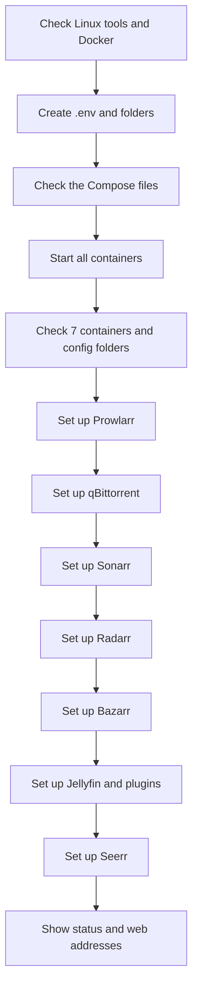
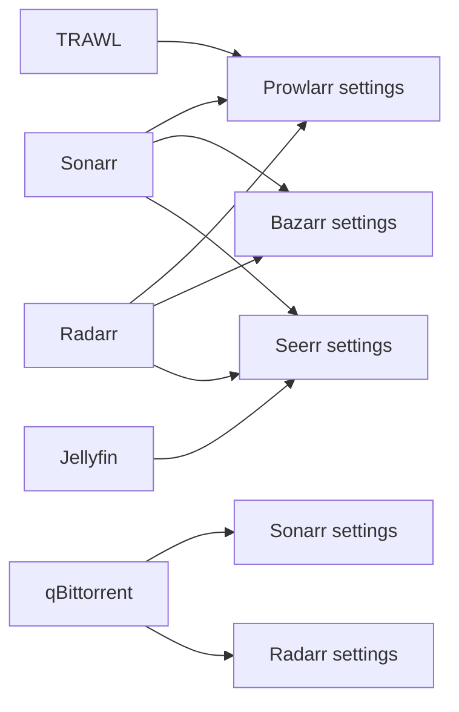

# What runs first and why

## Why order matters

Some setup scripts need another app to be ready first.

For example, Seerr cannot choose the `Anime` profile until Sonarr has created
that profile. If Custom Setup lets the user choose Seerr without Sonarr, the
current Seerr script will fail.

This file records those needs as they exist today.


## The full Linux Quick order



All containers start together before the first app setup script runs.


## What each setup needs

| Setup | What must already exist or be ready | Why |
|---|---|---|
| Prowlarr | Prowlarr, Sonarr, and Radarr config files; Prowlarr, Sonarr, and Radarr APIs; healthy TRAWL | It adds Sonarr, Radarr, and TRAWL inside Prowlarr. |
| qBittorrent | qBittorrent API; generated login values in `.env` | It changes the login, download path, and categories. |
| Sonarr | Sonarr config and API; qBittorrent running with the `.env` login | It adds two qBittorrent connections and tests them. |
| Radarr | Radarr config and API; qBittorrent running with the `.env` login | It adds and tests its qBittorrent connection. |
| Bazarr | Bazarr config and API; Sonarr and Radarr config files | It reads their API keys and connects Bazarr to both apps. |
| Jellyfin | Jellyfin API; Jellyfin admin values in `.env`; internet access for plugin lists | It creates or logs in to the admin, creates libraries, and downloads plugins. |
| Seerr | Seerr API; working Jellyfin admin; Jellyfin libraries; Sonarr and Radarr config files, folders, and profiles | It connects all three apps and chooses their folders and profiles. |


## Connections made by the current scripts

The arrow points to the app whose settings are changed.



Examples:

- Prowlarr owns its Sonarr, Radarr, and TRAWL entries.
- Sonarr owns its qBittorrent entries.
- Bazarr owns its Sonarr and Radarr entries.
- Seerr owns its Jellyfin, Sonarr, and Radarr entries.

This follows the rule that the app being changed owns the setup code.


## Docker starts fewer relationships than the setup scripts use

Compose declares only one direct start need:

```text
TRAWL needs TRAWL Redis.
```

The other app relationships are not written as Compose `depends_on` rules.
Instead, the Bash scripts wait for the files and APIs they need.

This is useful because `depends_on` only controls container start order. It does
not prove that an app is ready or that a needed profile has been created.


## Why the current order works

### Prowlarr is first

Prowlarr needs Sonarr, Radarr, and TRAWL to answer, but it does not need Sonarr
or Radarr to have their final folders and profiles yet. All three containers are
already running, so Prowlarr can add the connections.

### qBittorrent is before Sonarr and Radarr

The qBittorrent setup changes its login and creates the `sonarr`, `anime`, and
`radarr` categories. Sonarr and Radarr then use that login and those category
names.

### Bazarr is after Sonarr and Radarr

Bazarr reads the Sonarr and Radarr API keys and stores connections to both.
Running it later also means their main setup has already passed.

### Jellyfin is before Seerr

Jellyfin creates the admin and the Movies, TV Shows, and Anime libraries. Seerr
then uses that admin and enables those three libraries.

### Seerr is last

Seerr needs results made by several earlier scripts:

- the Jellyfin admin and libraries;
- the Radarr Movies folder and `Smart Downloader \\ הורדה חכמה` profile;
- the Sonarr TV and Anime folders;
- the Sonarr `Any` and `Anime` profiles.


## The Jellyfin plugin order today

Inside Jellyfin setup, plugins run in this order:

1. Add or update every plugin repository from `plugins.json`.
2. Install or enable every plugin from `plugins.json`.
3. Restart Jellyfin once if a plugin changed.
4. Wait for Jellyfin and log in again.
5. Check that every listed plugin is active.

This happens before Seerr setup. That is fine for installing Jellyfin Enhanced,
but Enhanced cannot receive its Seerr settings at this point because Seerr has
not been set up yet.

Jellyfin Enhanced and Intro Skipper both use this same install-and-restart
order today.

The future fix is not to move all Jellyfin setup after Seerr. The plugin runner
needs a later step for plugin settings that depend on another app.


## What this means for Custom Setup

The current setup scripts bundle several jobs together. Custom Setup cannot
safely choose every small part yet.

| If the user chooses... | Current script also expects... | What must become a separate choice later |
|---|---|---|
| Prowlarr setup | Sonarr, Radarr, and TRAWL | Prowlarr base setup, Arr connections, TRAWL proxy, public indexers, and private indexers |
| Sonarr setup | qBittorrent | Sonarr base settings, formats, profiles, anime routing, and download clients |
| Radarr setup | qBittorrent | Radarr base settings, formats, profiles, and download client |
| Bazarr setup | Sonarr and Radarr | Bazarr language/subtitle settings, provider, Sonarr connection, and Radarr connection |
| Jellyfin plugin setup | Both plugins in one file | One choice per plugin |
| Seerr setup | Jellyfin, Sonarr, and Radarr | The current complete Seerr setup requires all three; a smaller Seerr mode would be a later feature |

Quick can keep choosing all of these parts. Custom needs clear checks before it
can offer smaller choices.


## Simple rules for the new plan

The future install plan must be able to say:

- **needs:** this part cannot work without another selected part;
- **runs after:** both parts are selected, but one must finish first;
- **optional:** use this connection only when both sides were selected.

Examples:

| Part | Rule |
|---|---|
| Sonarr qBittorrent connection | Needs Sonarr and qBittorrent. Runs after qBittorrent login setup. |
| Bazarr Sonarr connection | Needs Bazarr and Sonarr. Runs after both base setups. |
| Seerr Jellyfin connection | Needs Seerr and Jellyfin. Runs after the Jellyfin admin exists. |
| Enhanced Seerr settings | Needs Jellyfin Enhanced and Seerr. Runs after the plugin is active and Seerr setup is finished. |
| Future Shokofin settings | Needs Jellyfin, Shokofin, and Shoko. Runs after both apps and the plugin are ready. |

These three simple rules are enough for the cases we know today. We should not
build a larger rule system until the code needs one.


## What does not need an app setup order today

- Nginx Proxy Manager has no automatic setup script.
- DuckDNS receives environment values directly from Compose.
- TRAWL has no separate setup script; Prowlarr only waits for its health check.
- TRAWL Redis starts only for TRAWL.


## When this document must change

Update this file when a setup script starts needing another app, when a job is
split into a smaller selectable part, or when the run order changes.
